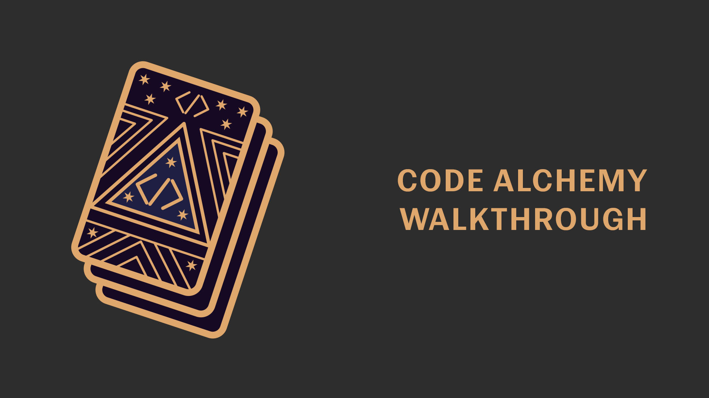

# Code Alchemy Portfolio

Welcome to **Martha Watson's Code Alchemy Portfolio**, a dynamic showcase of creativity and technical prowess, blending traditional art expertise with modern web development.

## Table of Contents
- [About](#about)
- [Features](#features)
- [Technologies](#technologies)
- [Setup](#setup)
- [Usage](#usage)
- [Color Palette](#color-palette)
- [Contact](#contact)
- [License](#license)

---

## About

This portfolio is a tribute to Martha Watson's journey as an artist turned software developer. With a degree in art and a passion for stained glass, sculpture, and painting, Martha brings a unique, tactile sensibility to the digital world. This project beautifully combines years of artistic experience with the cutting-edge technologies of modern web development.

## Features

- **Responsive Design**: Built with React and styled with React Bootstrap to provide a seamless experience across all devices.
- **Custom Styling**: A personalized color palette and styling to reflect Martha's artistic brand.
- **Portfolio Gallery**: Showcases a selection of projects in videography, photography, graphic design, and filmmaking.
- **Contact Form**: Easily get in touch for project inquiries or collaboration opportunities.
- **Resume Download**: Quick access to Martha's professional experience.

## Technologies

- **Frontend**: React, React Bootstrap, React Router
- **Styling**: Custom CSS, Bootstrap
- **Assets**: SVG images, high-quality project images

## Watch a video to see the functionality!
[](https://drive.google.com/file/d/1l7PHXb8RpDzfSdtw4o5g7mIHmglUZTfa/view?usp=drive_link)

## Setup

To run this project locally, follow these steps:

1. Clone the repository:
   ```bash
   git clone https://github.com/Elementary-my-dear-Watson/code-alchemy-portfolio.git
    ```

    ```bash
   cd code-alchemy-portfolio
    ```
    
    ```bash
   npm install
    ```

    ```bash
   npm run build
    ```

The app should now be running on http://localhost:5173/.

Usage
Explore the different pages using the navigation bar:

About: Learn more about Martha's artistic background and transition into coding.
Portfolio: Discover a variety of projects that blend creativity with technology.
Contact: Send a message using the built-in form.
Resume: View and download Martha's resume.


Color Palette
This project features a carefully curated color palette:

Alabaster: #f1f2ebff

Timberwolf: #d8dad3ff

Cambridge Blue: #a4c2a5ff

Ebony: #566246ff

Davy's Gray: #4a4a48ff

These colors have been chosen to give the portfolio a modern, elegant feel, while still being warm and inviting.

Contact
Want to collaborate or learn more? Reach out!

Email: marthacdenzer@gmail.com

GitHub: Elementary-my-dear-Watson

## License

This project is licensed under the MIT License.

## Credits

This project was built as part of a React Challenge. Thanks to Jacob Watson (Github: JakeStair) for contributions.